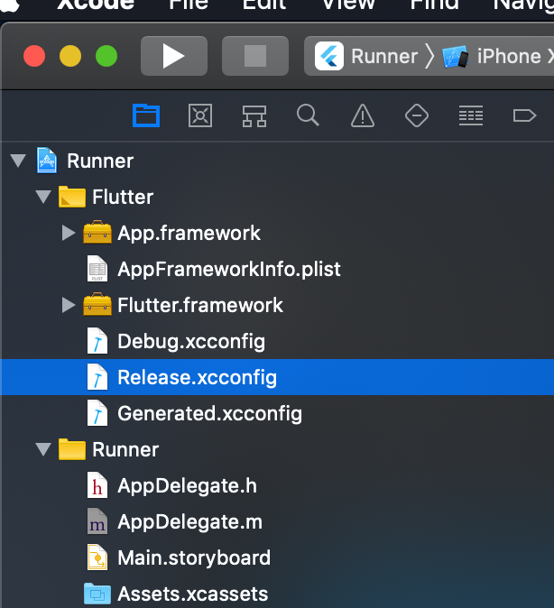
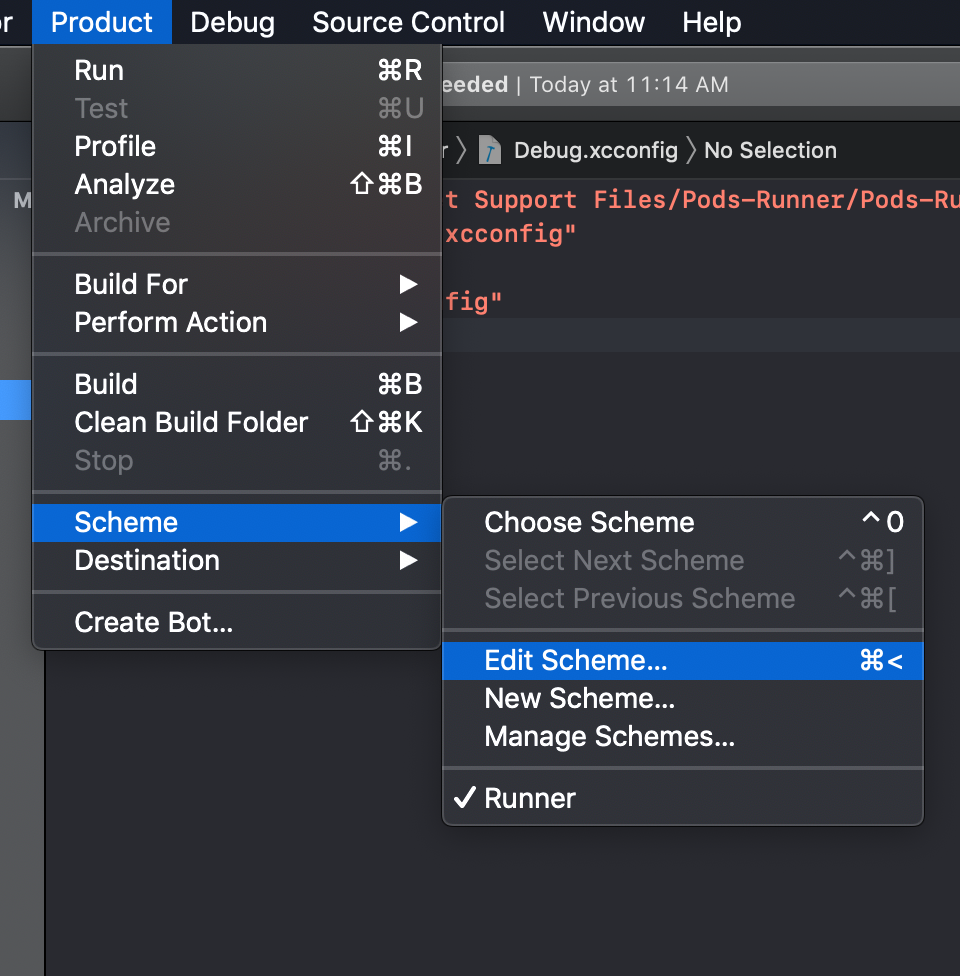
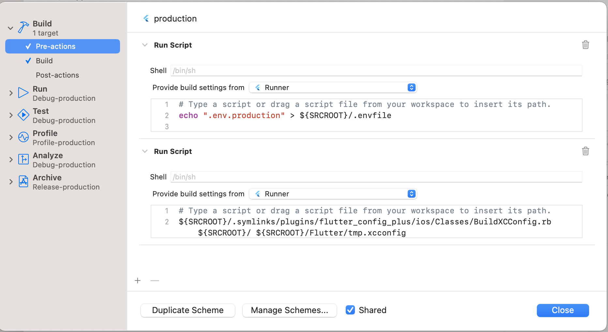

## iOS Advanced Setup

No additional setup is required is you are only reading env varibles from Obj-C/Swift code.

Read variables declared in `.env` from your Obj-C classes like:

```objective-c
// import header
#import "FlutterConfigEnvPlugin.h"

// then read individual keys like:
NSString *apiUrl = [FlutterConfigEnvPlugin envFor:@"API_URL"];

// or just fetch the whole config
NSDictionary *config = [FlutterConfigEnvPlugin env];
```

### Availability in Build settings and Info.plist

Extra steps are required if you are reading env varibles from your `info.plist` file

1. Under `Runner/Flutter`:
   
   You need to add the following code to both `Debug.xcconfig` and `Release.xcconfig`

   ```objective-c
   #include? "tmp.xcconfig"
   ```

   It is also recommended to add this file to gitignore
   ```
   **/ios/Flutter/tmp.xcconfig
   ```


2. In the Xcode menu, go to Product > Scheme > Edit Scheme
   

3. under Build > Pre-actions you need to add 2 new run script actions with the following code:
   

   ```
   echo ".env" > ${SRCROOT}/.envfile
   ```

   ```
   ${SRCROOT}/.symlinks/plugins/flutter_config_env/ios/Classes/BuildXCConfig.rb ${SRCROOT}/ ${SRCROOT}/Flutter/tmp.xcconfig
   ```

4. Make sure you select `Runner` from the `Provide build settings from` dropdown

   Your finished scripts should l ook like this:
   

5. By default, you should only need to do this for the runner scheme if you only have one environment.

This should now create a `tmp.xcconfig` file which can be accessed by `info.plist`

### Different environments

The basic idea in iOS is to have one scheme per environment file, so you can easily alternate between them.

Start by creating a new scheme:

- In the Xcode menu, go to Product > Scheme > Edit Scheme
- Click Duplicate Scheme on the bottom
- Give it a proper name on the top left. For instance: "Myapp (staging)"

#### NOTE
You need to make sure that your scheme name matches the `flavor` name which you defined on the flutter side of things
eg. `flutter run ios --flavor develop`

Then edit the newly created scheme to make it use a different env file. From the same "manage scheme" window:

In the Xcode menu, go to Product > Scheme > Manage Schemes > select your scheme > Click edit

- Follow steps 3 and 4 again for each scheme and replace you env files

```
echo ".env.staging" > ${SRCROOT}/.envfile   # replace .env.staging for your file
```

This is still a bit experimental and dirty – let us know if you have a better idea on how to make iOS use different configurations opening a pull request or issue!
